# Running Jupyter Notebooks on IBM Watson Studio Desktop

## Step 1 - Download IBM Watson Studio Desktop

If you are a member of the [IBM Academic Initiative](ibm.com/academic) you can use your academic institution issued email address to register or login and download IBM Watson Studio Desktop from the [Data Science page](ibm.com/academic/technology/data-science)

It may take a few minutes for the license to provision and the download to become available.

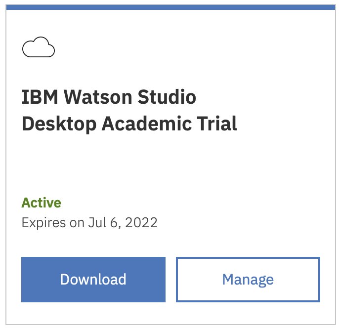

## Step 2 - Install IBM Watson Studio Desktop

Install Watson Studio Desktop using the appropriate process for your operating system.

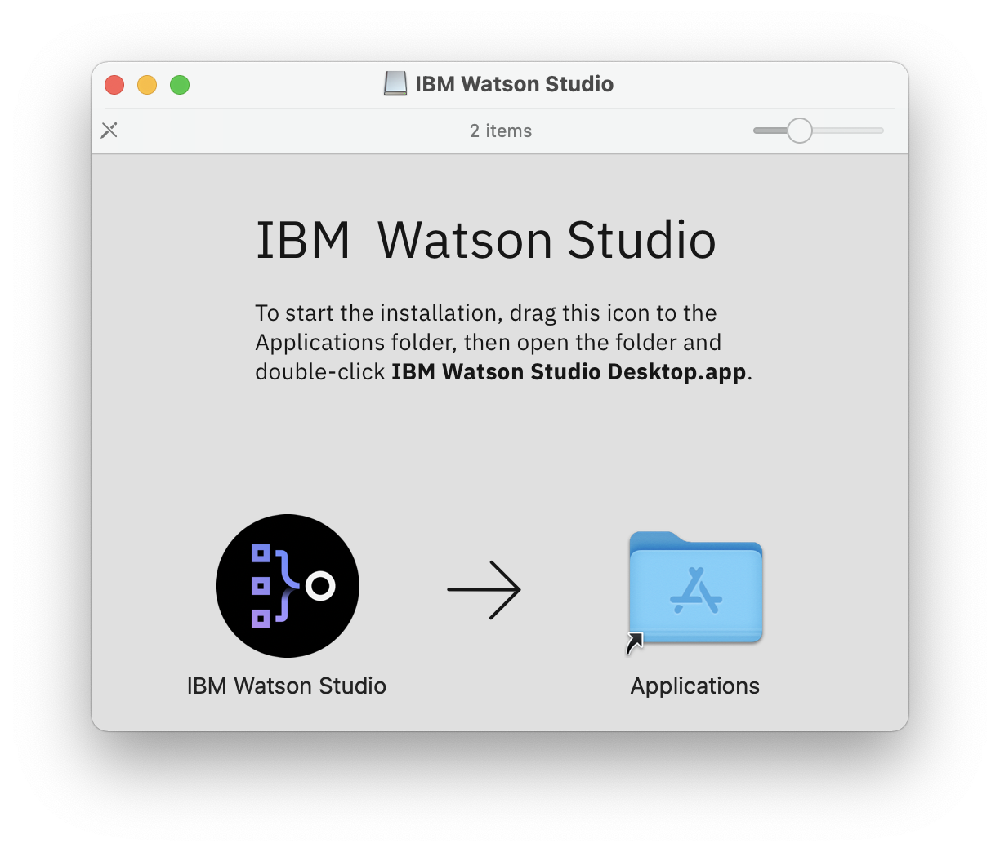

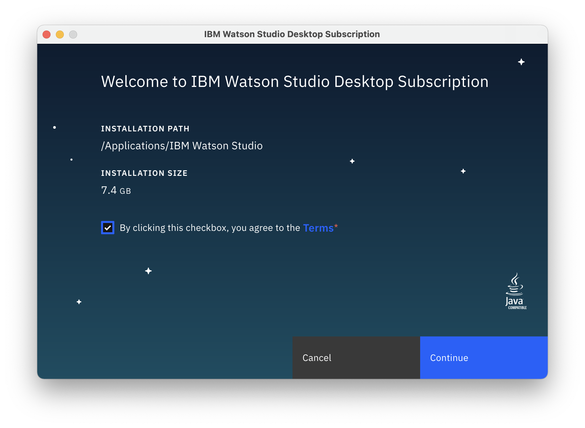

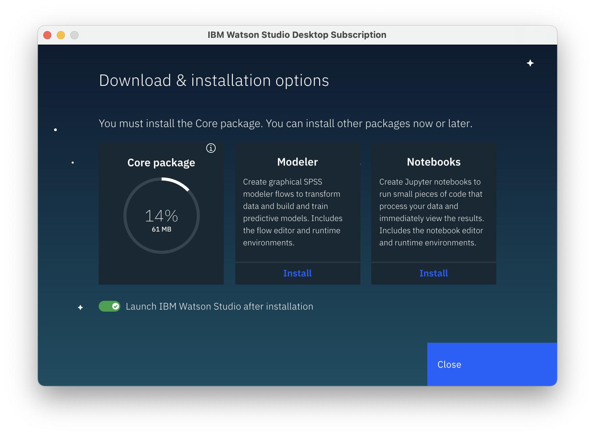

Click on the **Install** button under notebooks to install the Jupyter Notebook add-on

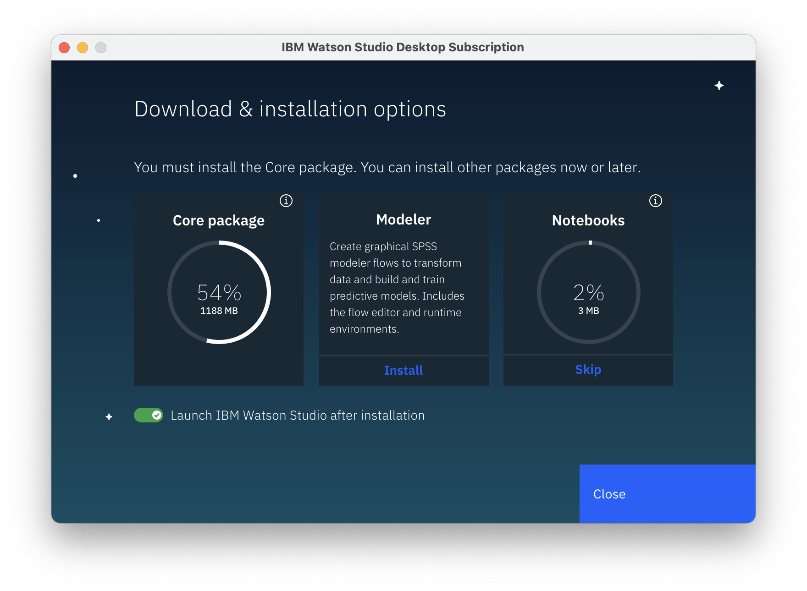

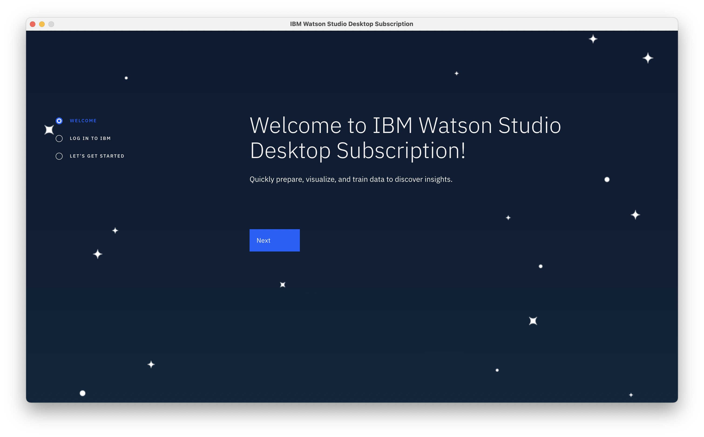

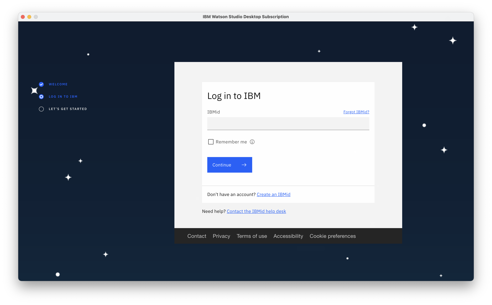

When prompted provide your IBMid credentials to validate your trial subscription

## Step3 - Create a project

When concluding the installation process you will be asked to create a new project.  This is optional, but a good opportunity to create your new project.

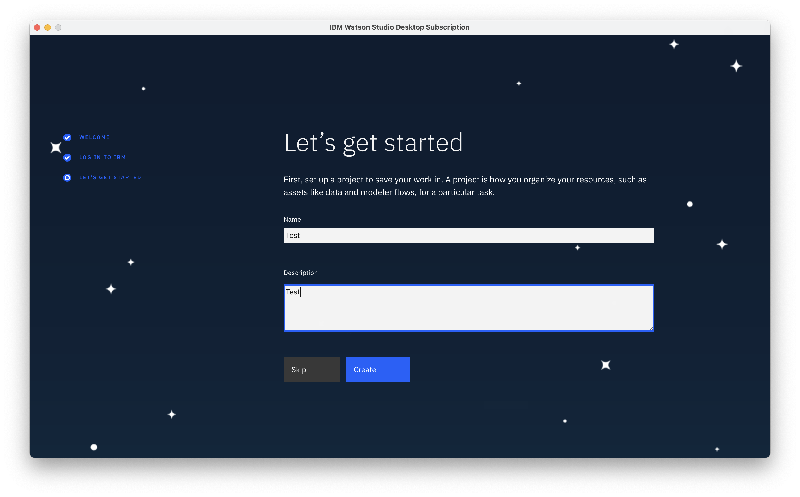

Once inside your new Watson Studio project click on the **Add To Project** button and select **Notebook**

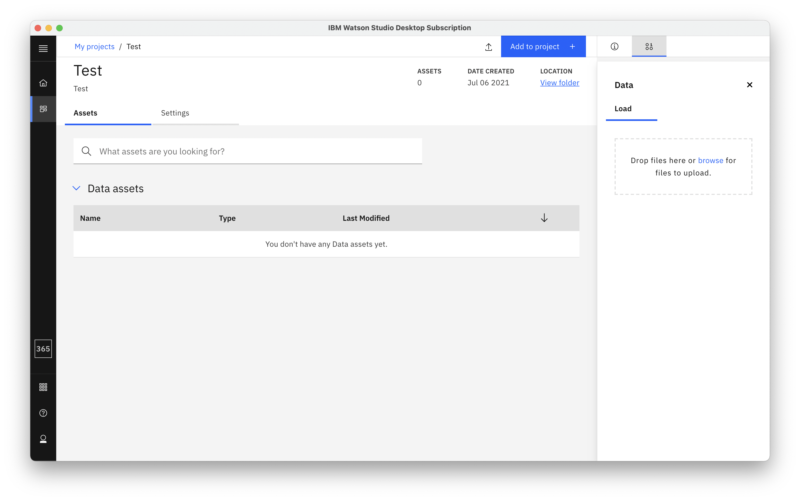

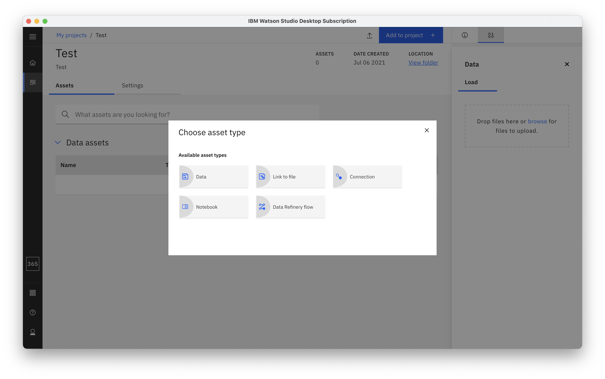

At this point you may be asked to install additional components to support Jupyter Notebooks.  This installation could take a few minutes.

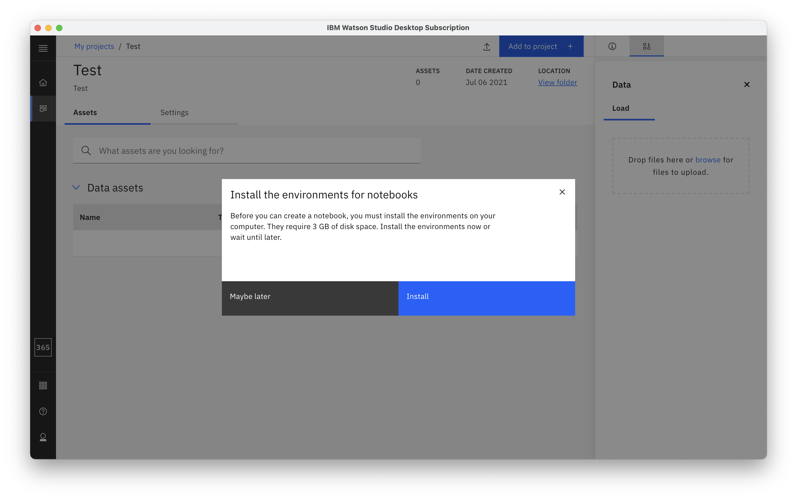

Once completed you can add Jupyter Notebooks to your project.

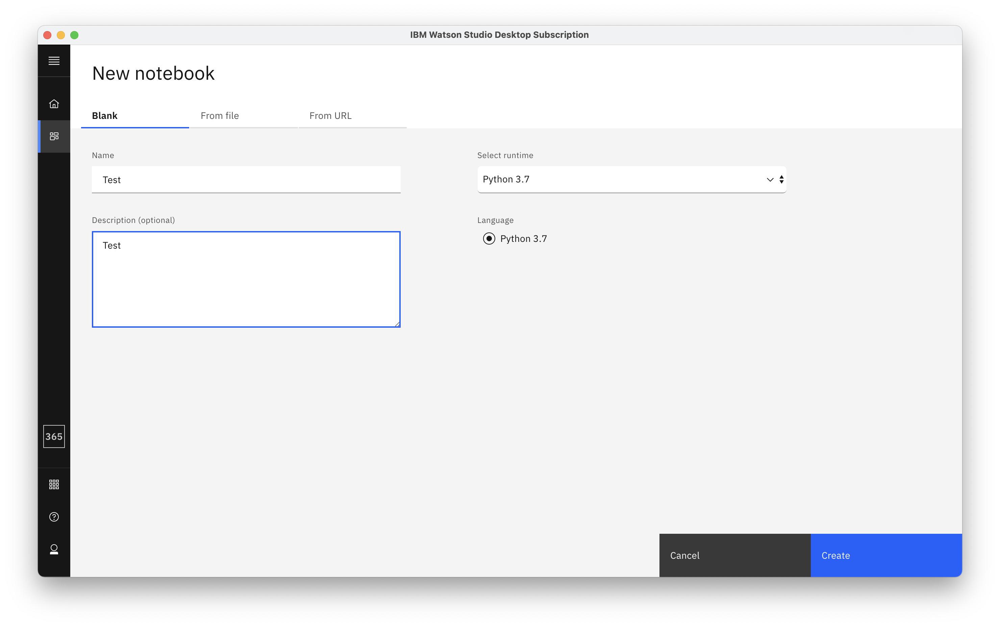

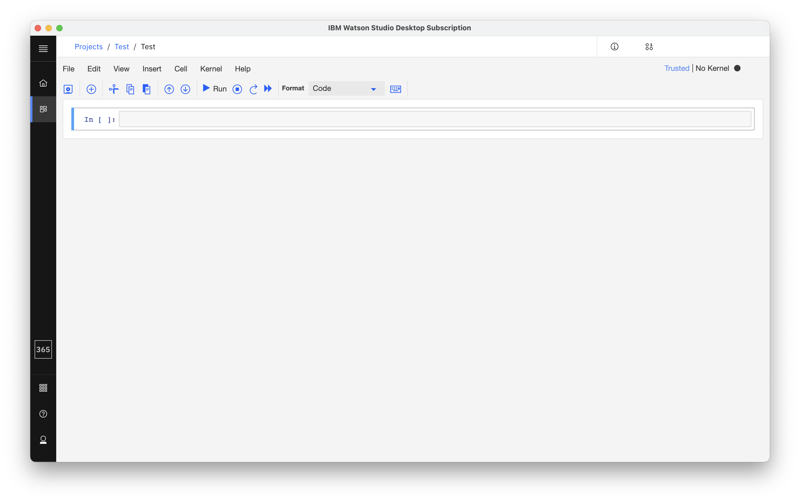